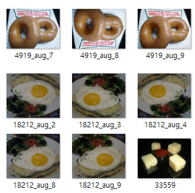
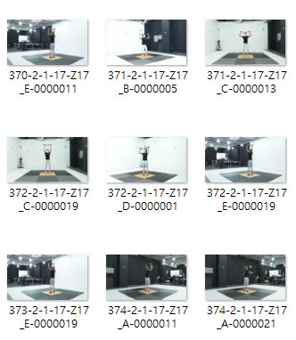

## 해야 할 일

1. 데이터 수집

   1-1. 영수증 처리 : 영수증은 API를 이용해서 OCR을 하는 솔루션이기 때문에 데이터 없음.
   1-2. 빈그릇 챌린지
     - 음식을 먹기 전 이미지 : food-101 dataset을 이용해 수집
     - 음식을 먹은 후 이미지 : dataset이 없어 instargram에서 "빈그릇 챌린지" 이미지를 크롤링해서 수집
     - Before, After 각 600여개의 Image Data 수집  
   1-3. 홈트 챌린지
     - AI-Hub에서 "피트니스 자세 이미지" 데이터를 이용해 홈트레이닝 이미지 수집
     - 바른 자세, 틀린 자세 각 1000여개의 Image Data 수집  

2. 데이터 전처리
   2-1. 빈그릇 챌린지
      - Image Data를 증식 기법을 이용해 10배 증식
      - 먹기 전 이미지를 1, 먹은 후 이미지를 0으로 정의 ( 결과값은 0 ~ 1 사이의 실수를 반환 )
      - CNN Model을 위해 150x150 사이즈로 조정
      
      
   2-2. 홈트 챌린지
      - 바른 자세를 1, 틀린 자세를 0으로 정의 ( 결과값은 0 ~ 1 사이의 실수를 반환 )
      - CNN Model을 위해 150x150 사이즈로 조정
      

5. 모델링

6. 배포
