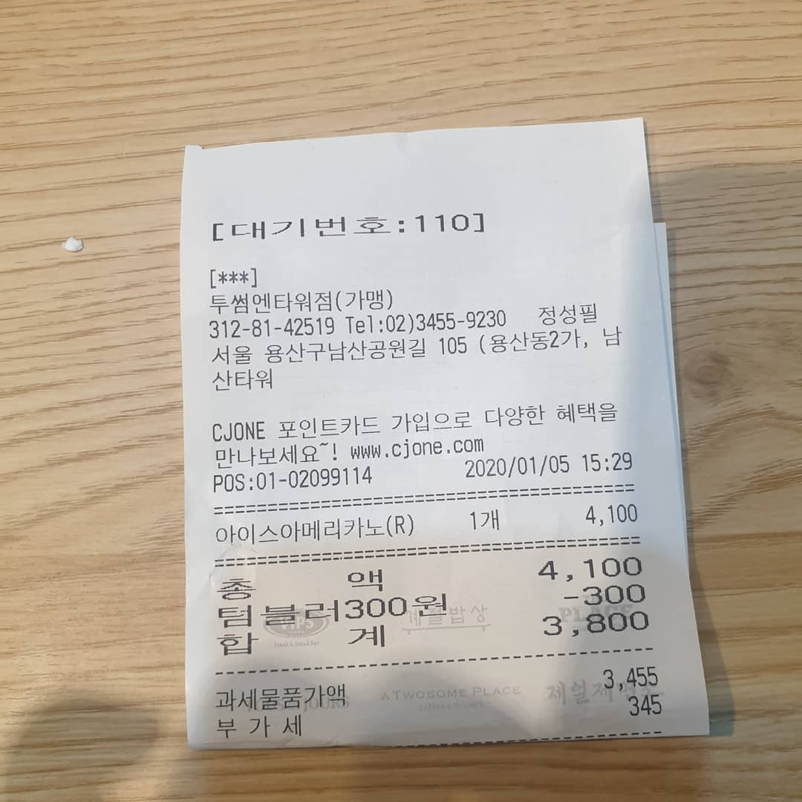
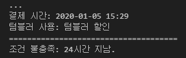
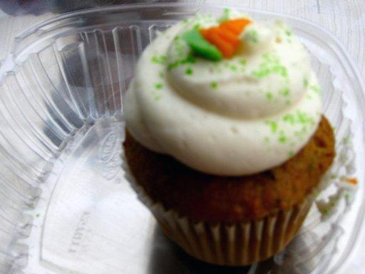
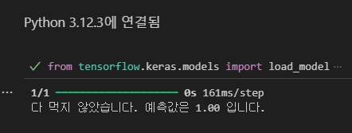
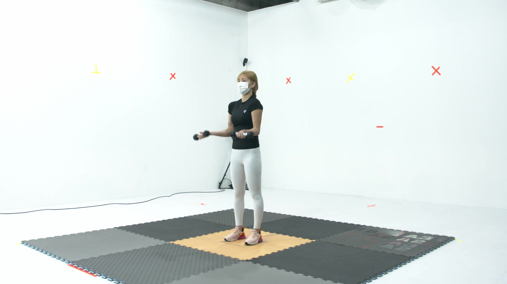
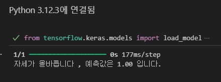
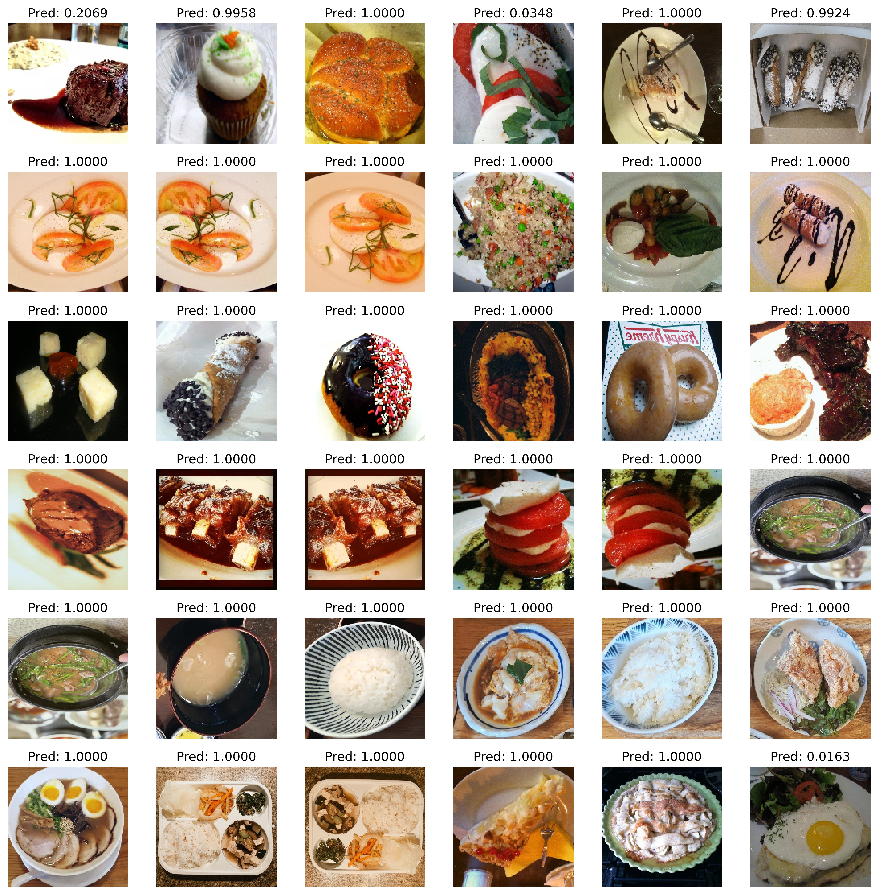
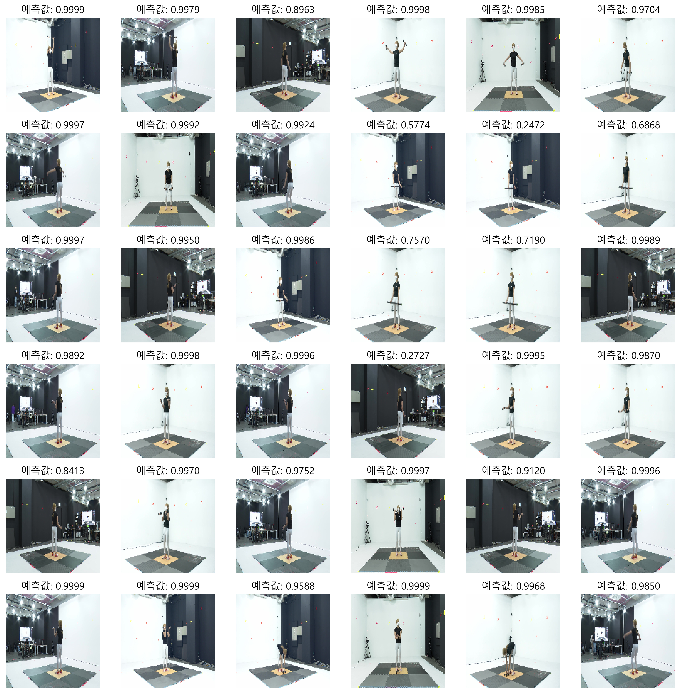

1. 데이터 수집

   1-1. 영수증 처리 : 영수증은 API를 이용해서 OCR을 하는 솔루션이기 때문에 데이터 없음.
   
   1-2. 빈그릇 챌린지
   
     - 음식을 먹기 전 이미지 : food-101 dataset을 이용해 수집
     - 음식을 먹은 후 이미지 : dataset이 없어 instargram에서 "빈그릇 챌린지" 이미지를 크롤링해서 수집
     - Before, After 각 600여개의 Image Data 수집
       
   1-3. 홈트 챌린지
   
     - AI-Hub에서 "피트니스 자세 이미지" 데이터를 이용해 홈트레이닝 이미지 수집
     - 바른 자세, 틀린 자세 각 1000여개의 Image Data 수집  

3. 데이터 전처리

   2-1. 빈그릇 챌린지

      - Image Data를 증식 기법을 이용해 10배 증식
      - 먹기 전 이미지를 1, 먹은 후 이미지를 0으로 정의 ( 결과값은 0 ~ 1 사이의 실수를 반환 )
      - CNN Model을 위해 150x150 사이즈로 조정

      
      
   2-2. 홈트 챌린지

      - 바른 자세를 1, 틀린 자세를 0으로 정의 ( 결과값은 0 ~ 1 사이의 실수를 반환 )
      - CNN Model을 위해 150x150 사이즈로 조정

      

4. 모델링

   3-1. 영수증 처리

      - 영수증을 Image로 받으면, Google Vision API의 OCR 기능을 이용해 텍스트 저장
      - 저장된 텍스트를 GPT-API에 전용 프롬포트를 만들어서 질문
      - 만약, 영수증이 24시간 미만이면서, 영수증에 텀블러 할인 관련 문구가 있다면 리워드 반환.
  
   3-2. 빈그릇 챌린지

      - CNN에 넣기 전에 이미지 RGB값을 0~1 사이의 값으로 넣어야하기에 1/255로 rescale.
      - Conv2D를 이용해 신경망을 쌓고 이진 분류를 위해 sigmoid 사용
      - 50번 학습 결과 accuracy 약 92%
        
   3-3. 홈트 챌린지

      - CNN에 넣기 전에 이미지 RGB값을 0~1 사이의 값으로 넣어야하기에 1/255로 rescale.
      - Conv2D를 이용해 신경망을 쌓고 이진 분류를 위해 sigmoid 사용
      - 50번 학습 결과 accuracy 약 88%

5. 테스트

    4-1. 영수증 처리
   
    input
   
    
    
    output
   
    

    4-2. 빈그릇 챌린지
   
    input
   
    

    output ( 0-0.5 : 다먹음, 0.5-1 : 덜먹음 )
   
    

    4-3. 홈트 챌린지
   
    input
   
    
    
    output ( 0-0.5 : 틀린자세, 0.5-1 : 바른자세 )
   
    
    
6. 시각화

   5-1. 빈그릇 챌린지

   

   5-2. 홈트 챌린지

   

7. 배포

   - Flask를 사용해서 model 및 .py 코드 배포.
  ```flask —app earthcpr-ai.py run —host=0.0.0.0 &```
